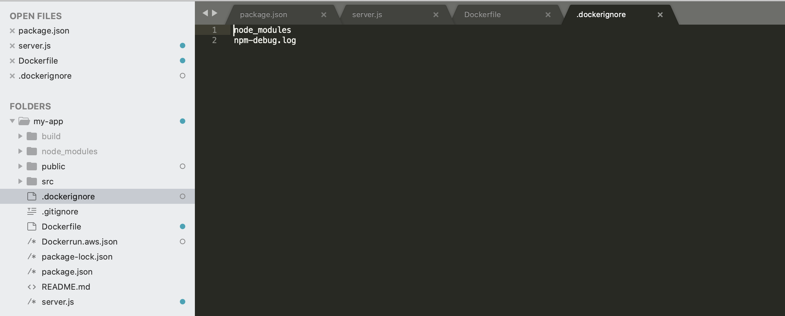

This tutorial Node.JS app can be accessed [here](https://spontit.info).

# Introduction
This node web app is a [React](https://reactjs.org/) web app served by [Express](https://expressjs.com/). It is dockerized and then published on AWS Elastic Beanstalk.

# Create React App and Serve on Express
### Install dependencies
First, create a react app named 'my-app' and go into the folder:
`npx create-react-app my-app`
`cd my-app`
Then, install and save express:
`npm install express --save`
Once you have finished the above steps, you may run the React app in the development mode:
`npm run start`
### Serve React app
Create 'server.js' file as following and save it in the project root folder:
```
const express = require('express');
const bodyParser = require('body-parser')
const path = require('path');
const app = express();
app.use(express.static(path.join(__dirname, 'build')));

const PORT = process.env.PORT || 8080;
const HOST = '0.0.0.0';

app.get('/hello', (req, res) => {
  return res.send('Hello World!')
});

app.get('/', (req, res) => {
  res.sendFile(path.join(__dirname, 'build', 'index.html'));
});

app.listen(PORT);
console.log(`Running on http://${HOST}:${PORT}`);
```

In package.json file, add:
 `"proxy": "http://localhost:8080"` 
After finishing the above steps, you may run build on your React app:
 `npm run build`
and run Express to serve the React app:
 `node server.js`
 
 # Dockerize the app
To use docker, sign up on [Docker](https://docker.com) and install Docker and/or Docker Desktop as needed.
Once Docker installation is complete, create a file named 'Dockerfile' by running:
`touch Dockerfile`
### Edit Dockerfile
In the Dockerfile, specify the image you want to build from. The latest image number for node.js app is available on the [Docker Hub](https://hub.docker.com/).
`FROM node:14`
Next, create the working directory of your app:
`WORKDIR /usr/src/app`
Then, copy your package.json and install the dependencies by adding the following lines:
`COPY package*.json ./`
`RUN npm install`
To bundle the source code in your app, add:
`COPY . .`
Your app runs on port 8080, so add this line:
`EXPOSE 8080`
End by specify the command for starting your app:
`CMD [ "node", "server.js" ]`
The complete Dockerfile should look like this:
```
FROM node:14

WORKDIR /usr/src/app

COPY package*.json ./

RUN npm install

COPY . .

EXPOSE 8080

CMD [ "node", "server.js" ]
```

### Add .dockerignore file
Create .dockerignore file and add the lines as following:
`node_modules`
`npm-debug.log`
This will prevent local node modules and debug logs from being copied into the Docker image.
Screenshot of .dockerignore:


### Build, run, and push the docker image
To build the docker image, run the following command:
`docker build -t <your username>/<your app name> .`
To run the built image on port 49160, run:
`docker run -p 49160:8080 -d <your username>/<your app name>`
The -p flag redirects a public port to a private port inside the container.
To confirm that the image is running, run:
`docker ps`
In order to deploy a remote docker image to AWS Elastic Beanstalk, push the image to Docker Hub:
`docker push <your username>/<your app name>:latest`

**Learn More**
For reference, Node.JS has published a guide on how to dockerize a Node.JS app [here](https://nodejs.org/de/docs/guides/nodejs-docker-webapp/).

# Deploy Docker Container on AWS Elastic Beanstalk
If you have not used AWS Elastic Beanstalk before, you may get started by reading the [documentations](https://docs.aws.amazon.com/elasticbeanstalk/latest/dg/GettingStarted.html).

### Create Dockerrun.aws.json
Create Dockerrun.aws.json file as following:
```
{
  "AWSEBDockerrunVersion": "1",
  "Image": {
    "Name": "your-docker-username/repo-name",
    "Update": "true"
  },
  "Ports": [
    {
      "ContainerPort": "8080"
    }
  ]
}
```
This includes information on the remote docker image that Elastic Beanstalk should pull. We will then create a Elastic Beanstalk app and upload this file.

### Set up Elastic Beanstalk app and deploy


**Learn More**
For reference, AWS has documentations on deploying docker container on AWS Elastic Beanstalk [here](https://docs.aws.amazon.com/elasticbeanstalk/latest/dg/single-container-docker.html).