This tutorial Node.JS app can be accessed [here](https://spontit.info).
<br>
# Introduction
This node web app is a [React](https://reactjs.org/) web app served by [Express](https://expressjs.com/). It is dockerized and then published on AWS Elastic Beanstalk.
<br>
# Create React App and Serve on Express
### Install dependencies
First, create a react app named 'my-app' and go into the folder:<br>
`npx create-react-app my-app`<br>
`cd my-app`<br>
Then, install and save express:<br>
`npm install express --save`<br>
Once you have finished the above steps, you may run the React app in the development mode:
`npm run start`
<br>
### Serve React app
Create 'server.js' file as following and save it in the project root folder:
```
const express = require('express');
const bodyParser = require('body-parser')
const path = require('path');
const app = express();
app.use(express.static(path.join(__dirname, 'build')));

const PORT = process.env.PORT || 8080;
const HOST = '0.0.0.0';

app.get('/hello', (req, res) => {
  return res.send('Hello World!')
});

app.get('/', (req, res) => {
  res.sendFile(path.join(__dirname, 'build', 'index.html'));
});

app.listen(PORT);
console.log(`Running on http://${HOST}:${PORT}`);
```

In package.json file, add:<br>
 `"proxy": "http://localhost:8080"` <br>
After finishing the above steps, you may run build on your React app:<br>
 `npm run build`<br>
and run Express to serve the React app:<br>
 `node server.js`
 <br>
 # Dockerize the app
To use docker, sign up on [Docker](https://docker.com) and install Docker and/or Docker Desktop as needed.
Once Docker installation is complete, create a file named 'Dockerfile' by running:<br>
`touch Dockerfile`
### Edit Dockerfile
In the Dockerfile, specify the image you want to build from. The latest image number for node.js app is available on the [Docker Hub](https://hub.docker.com/).<br>
`FROM node:14`<br>
Next, create the working directory of your app:<br>
`WORKDIR /usr/src/app`<br>
Then, copy your package.json and install the dependencies by adding the following lines:<br>
`COPY package*.json ./`<br>
`RUN npm install`<br>
To bundle the source code in your app, add:<br>
`COPY . .`<br>
Your app runs on port 8080, so add this line:<br>
`EXPOSE 8080`<br>
End by specify the command for starting your app:<br>
`CMD [ "node", "server.js" ]`<br>
The complete Dockerfile should look like this:<br>
```
FROM node:14

WORKDIR /usr/src/app

COPY package*.json ./

RUN npm install

COPY . .

EXPOSE 8080

CMD [ "node", "server.js" ]
```

### Add .dockerignore file
Create .dockerignore file and add the lines as following:
`node_modules`
`npm-debug.log`
This will prevent local node modules and debug logs from being copied into the Docker image.
Screenshot of .dockerignore:


### Build, run, and push the docker image
To build the docker image, run the following command:<br>
`docker build -t <your username>/<your app name> .`<br>
To run the built image on port 49160, run:<br>
`docker run -p 49160:8080 -d <your username>/<your app name>`<br>
The -p flag redirects a public port to a private port inside the container.<br>
To confirm that the image is running, run:<br>
`docker ps`<br>
In order to deploy a remote docker image to AWS Elastic Beanstalk, push the image to Docker Hub:<br>
`docker push <your username>/<your app name>:latest`<br>

**Learn More**<br>
For reference, Node.JS has published a guide on how to dockerize a Node.JS app [here](https://nodejs.org/de/docs/guides/nodejs-docker-webapp/).
<br>
# Deploy Docker Container on AWS Elastic Beanstalk
If you have not used AWS Elastic Beanstalk before, you can get started by reading the [documentations](https://docs.aws.amazon.com/elasticbeanstalk/latest/dg/GettingStarted.html).

### Create Dockerrun.aws.json
Create Dockerrun.aws.json file as following:
```
{
  "AWSEBDockerrunVersion": "1",
  "Image": {
    "Name": "your-docker-username/repo-name",
    "Update": "true"
  },
  "Ports": [
    {
      "ContainerPort": "8080"
    }
  ]
}
```
This includes information on the remote docker image that Elastic Beanstalk should pull. We will then create a Elastic Beanstalk app and upload this file.

### Set up Elastic Beanstalk app and deploy
To set up your app on Elastic Beanstalk, first, go to Elastic Beanstalk console -> Applications, and click on "Create a New Application".<br>
Enter your application name: <br>
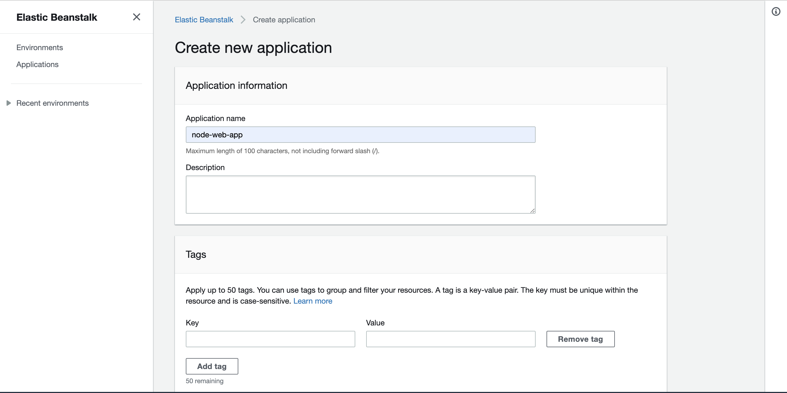
Click on "Create a New Environment" for the app you just created:<br>
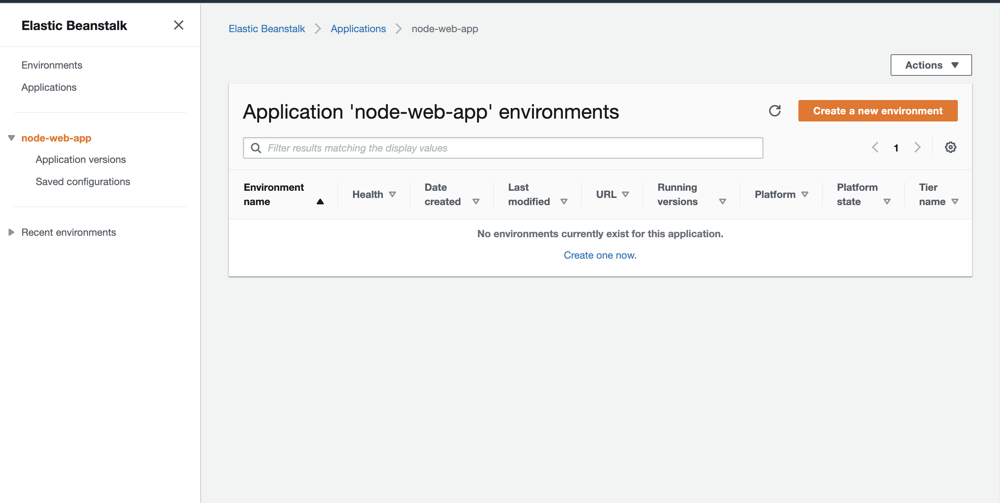
Select 'Web server environment' for this app:<br>
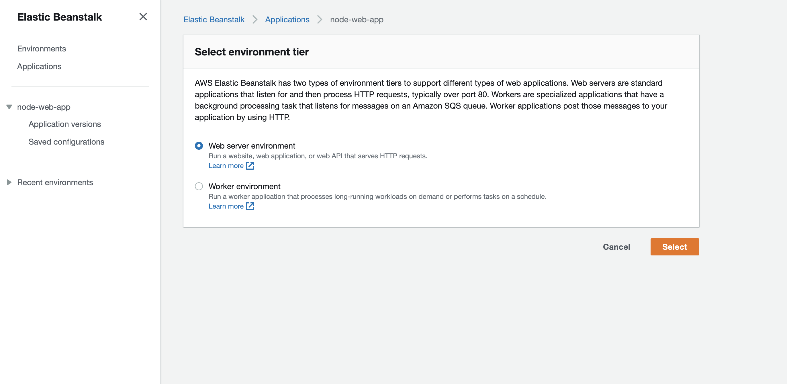
For 'Platform', Choose 'Docker', and the platform branch and version as you like.<br>
For 'Application code', choose 'Upload your code', and upload Dockerrun.aws.json you just created:<br>
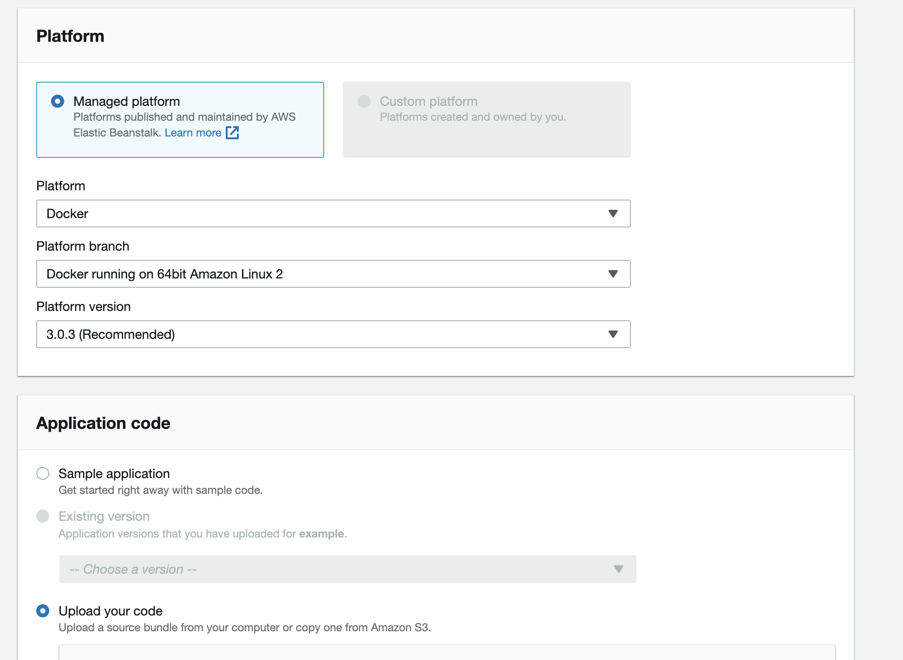
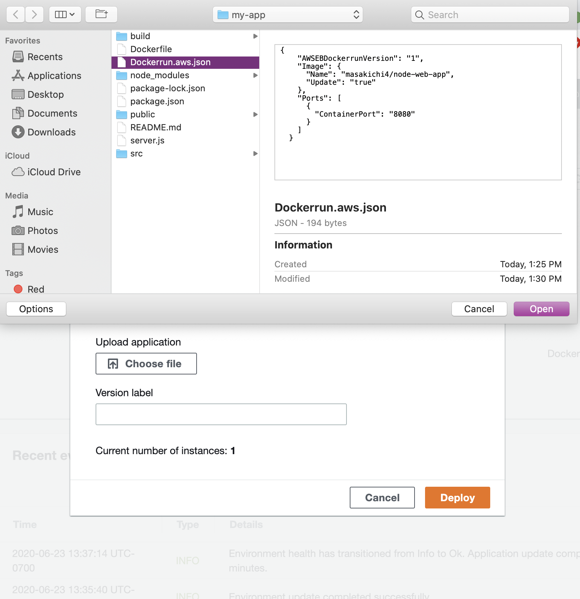
Navigate to 'Configure more options', and choose a preset configuration or create a configuration that contains a load balancer.<br>
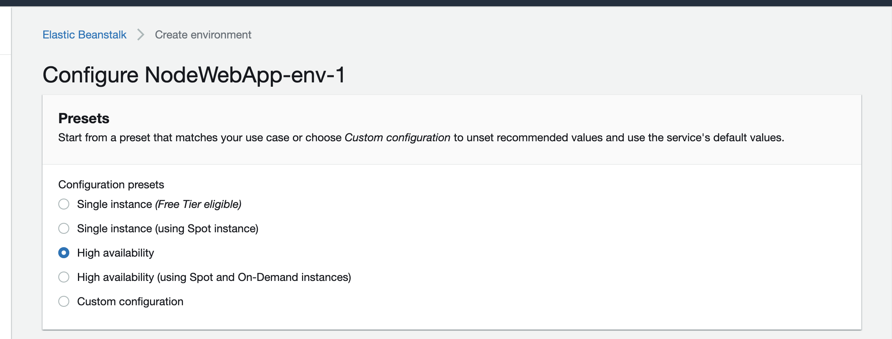
The app will be created in a  moment and will be deployed at the elasticbeanstalk address:<br>
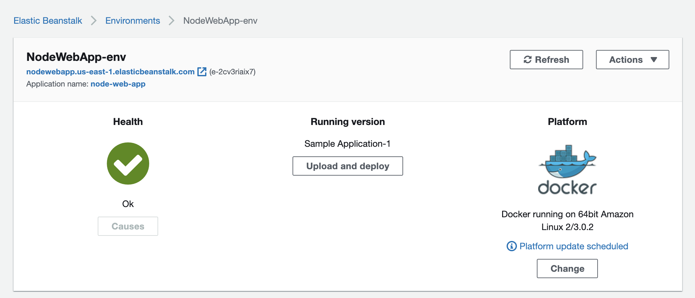
**Learn More**<br>
For reference, AWS has [documentations](https://docs.aws.amazon.com/elasticbeanstalk/latest/dg/single-container-docker.html) on deploying docker container on AWS Elastic Beanstalk.
<br>
# Connect to a Custom Domain (Google Domains)
### Add CNAME records
You may purchase a domain address on any platform as you like. This example will demonstrate how to connect your deployed app with an address purchased from Google Domains.<br>
First, choose a domain name you like and purchase it.<br>
The domain address will show in your Google Domains account after purchase. Go to 'DNS' on the left menu, and scroll to 'Custom resource records'<br>
Add a CNAME record, put in your elastic beanstalk app address as 'data' and 'www' as 'name':<br>
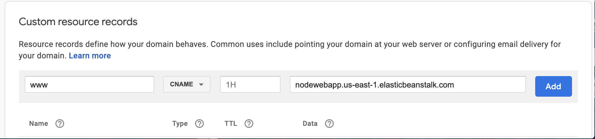
### Add name servers
We also need to add custom name servers on 'DNS' page. We will do this in "Name Servers" section.<br>
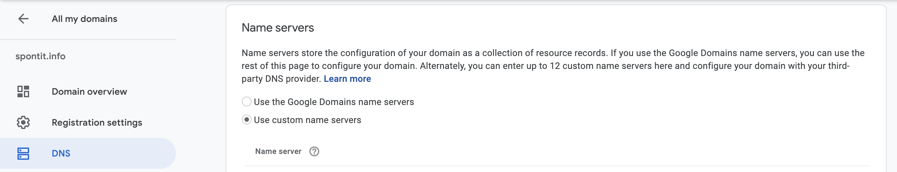
According to AWS, 'a hosted zone tells Route 53 how to respond to DNS queries for a domain'. Let's first create a hosted zone on AWS Route 53. <br>
Navigate to Route 53 in AWS console, and then to 'Hosted zones'. <br>
Click on 'Create Hosted Zone', and enter the domain address you just purchased:<br>
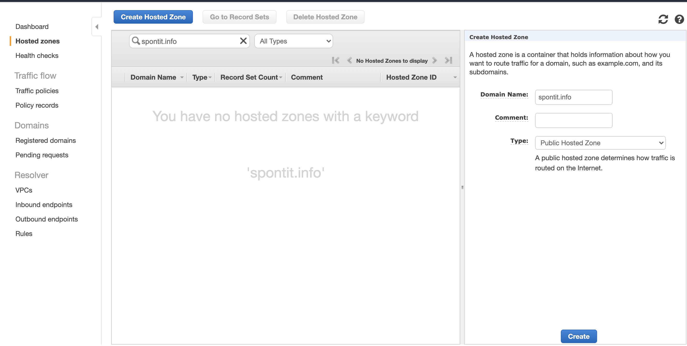
A hosted zone will be created: <br>
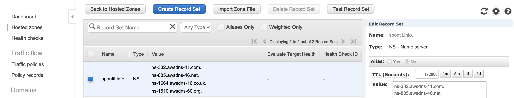
Copy the 'values' listed for type 'NS' one by one to 'custom name servers' in Google Domains:<br>
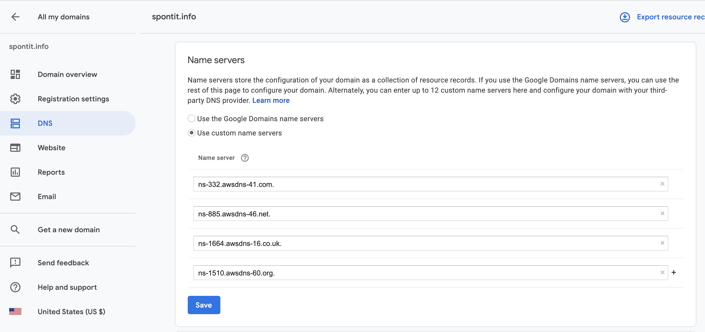
<br>
**Notice** that changes made on Google Domains may take up to 48 hours to take effect.
### Set up HTTPS for your domain
To set up HTTPS, we should get an SSL certificate on AWS and link it to the domain address.
1. Go to AWS Certificate Manager to request an SSL certificate. Choose to 'request a public certificate', enter your domain name when prompted, select 'DNS validation' as validation method.<br>
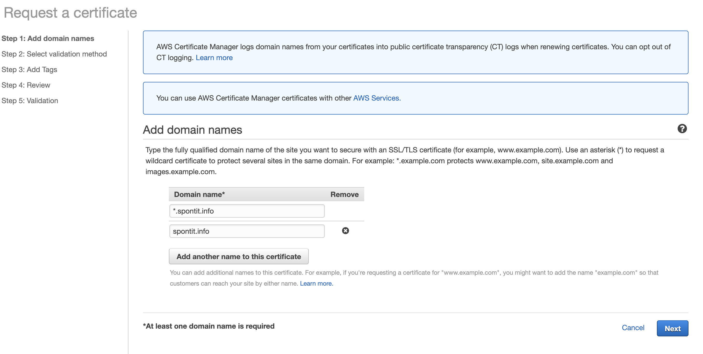
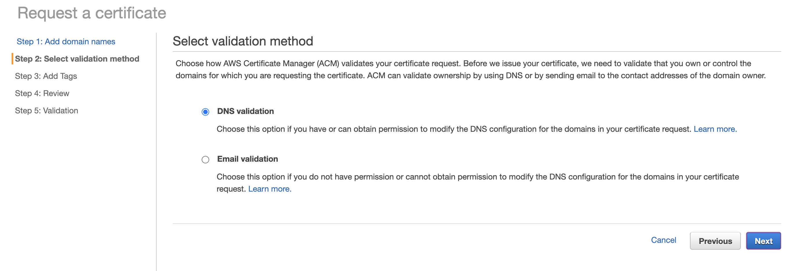
2. Link to Elastic Beanstalk.<br>
Go to your Elastic Beanstalk app, navigate to Configuration -> Load Balancer.<br>
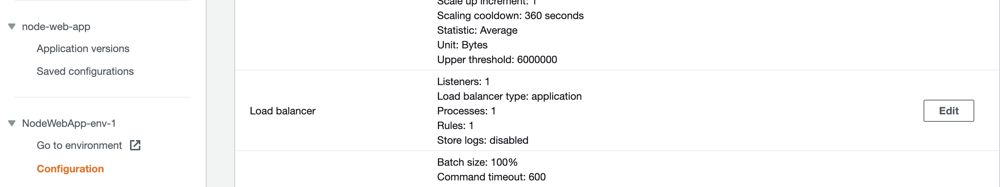
Edit the configuration of listeners for your load balancer. Choose 'HTTPS' and choose the SSL certificate you just received:<br>
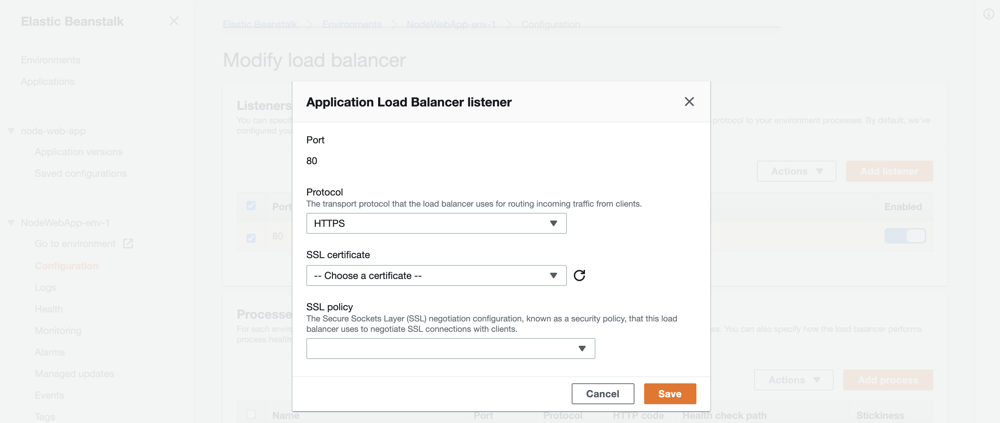


